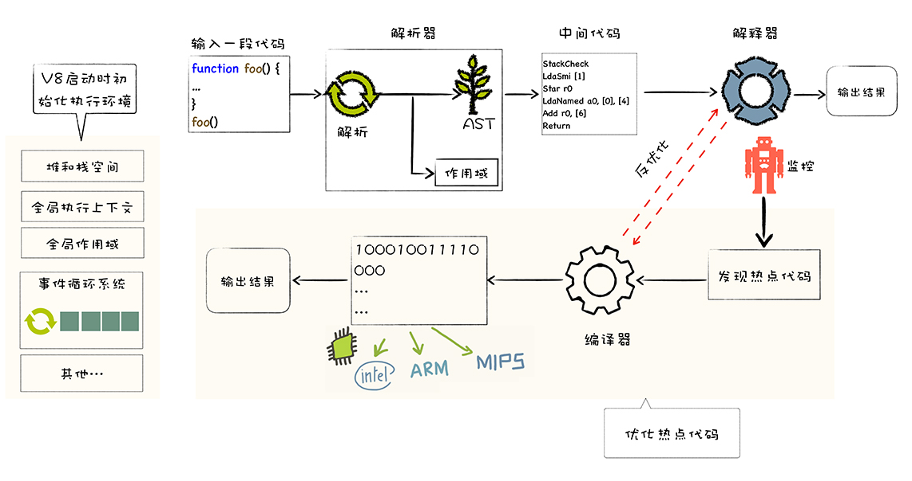

编程语言分词
构建 AST 抽象语法树的过程又被称作 **语法分析**
> 语法分析算法：LL（left left 算法，从左到右扫描和规约） 算法、LR 算法

### 四则运算的分析：
有意义的输入，被称作 token，一种是 数字 Number，一种是 运算符 Operator
- TokenNumber：0 ~ 9 以及小数点
- Operator：+ - * / 之一

### Javascript 代码是如何运行起来的
对于常见编译型语言（例如：Java）来说，编译步骤分为：词法分析->语法分析->语义检查->代码优化和字节码生成。
对于解释型语言（例如 JavaScript）来说，通过**词法分析** -> **语法分析** -> **语法树**，就可以开始解释执行了。

- 词法分析是将字符流(char stream)转换为记号流(token stream)
- 语法分析成 AST (Abstract Syntax Tree)
- 预编译，当JavaScript引擎解析脚本时，它会在预编译期对所有声明的变量和函数进行处理！并且是先预声明变量，再预定义函数！
- 解释执行，在执行过程中，JavaScript 引擎是严格按着作用域机制（scope）来执行的，并且 JavaScript 的变量和函数作用域是在定义时决定的，而不是执行时决定的。JavaScript 中的变量作用域在函数体内有效，无块作用域；

### V8 是怎么执行 JavaScript 代码的？
V8 作为 JavaScript 的虚拟机的一种，它并没有采用解释执行、编译执行中某种单一的技术，而是混合编译执行和解释执行这两种手段，我们把这种混合使用编译器和解释器的技术称为 JIT（Just In Time）技术。这是一种权衡策略，因为这两种方法都各自有各自的优缺点，解释执行的启动速度快，但是执行时的速度慢，而编译执行的启动速度慢，但是执行时的速度快。

