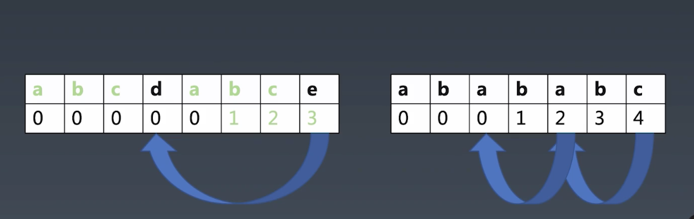

### 字典树：
  大量高度重复字符串的存储与分析（例如：匹配一个亿长度的字符串）

### KMP 匹配算法：
  在长字符串中匹配部分字符串（算法可达到 m+n 时间复杂度）
  在 source 字符串中查找 pattern 字符串，暴力算法时间复杂度是 m*n(m n 分别是两个字符串的长度)
  

### Wildcard：
  带通配符（？*）的匹配模式（弱正则）
  - 分析 * 数量
  - 分析 ?
  - 只有 *
  - 只有 ?

  正则的 lastIndex 很重要，关系到 exec 方法返回的数据

### 正则：
  字符串通用匹配模式

### 状态机：
  通用的字符串分析（可对字符串做额外处理）

### LL LR：
  字符串多层级结构分析（语法分析）
