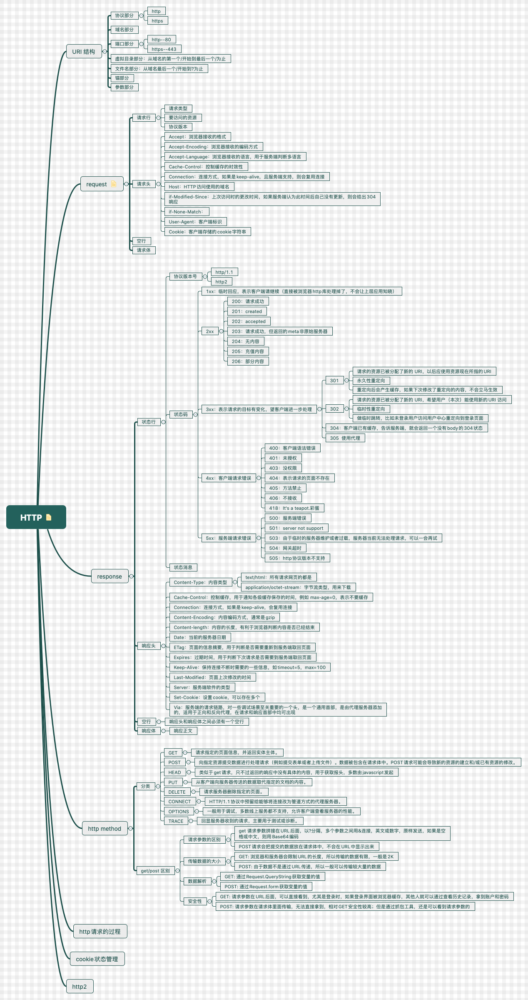

## HTTP 协议解析

### 1. ISO-OSI 七层网络模型

|层|对应关系|
|:---:|:---:|
|应用   表示   会话| HTTP |
|传输| TCP |
|网络| internet |
|数据链路   物理层| 4G/5G/Wi-Fi |

### 2. TCP 与 IP 的一些基础知识
- 流
- 端口
- require('net')
- 包
- IP 地址(唯一标识)
- libnet/libpcap（c++库 构造IP包并且发送 / 从网卡抓取所有的流经网卡的IP包）

### 3. HTTP

### 4. ToyBrowser 实现过程
第一步：HTTP 请求总结
- 设计一个 HTTP 请求的类
- content-type 是一个必要的字段，要有默认值
- body 是 key value 格式
- 不同的 content-type 影响 body 的格式
- 需要有一个 content-length

第二步：send 函数
- 在 request 的构造器中收集必要的信息
- 设计一个 send 函数，把请求真实发送到服务器
- send 函数是一个一部函数，返回一个 Promise

第三步：发送请求
- 设计支持已有的 connection 或者新建 connection
- 收到数据传给 parser
- 根据 parser 的状态resolve Promise

第四步：ReponseParser 总结
- Response 必须分段构造，所以我们要用一个 ResponseParser 来'装配'
- ResponseParser 分段戳筛查 ResponseText，用状态机来分析文本的结构

第五步：ResponseBody 的解析
- Response 的 body 可能根据 Content-Type 有不同的结构，因此采用子 Parser 的结构来解决问题
- 以 TrunkedBodyParser 为例，同样用状态机来处理 body 的格式